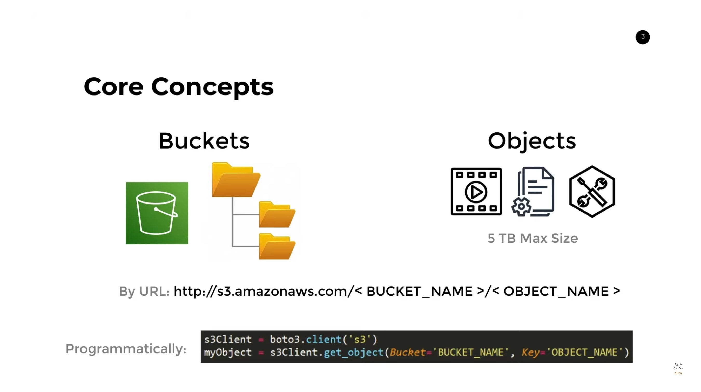
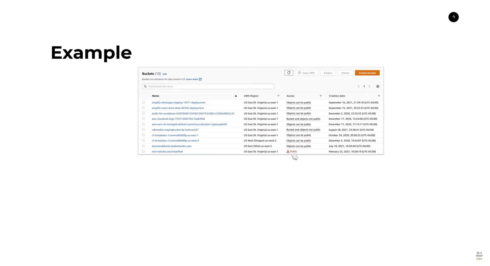
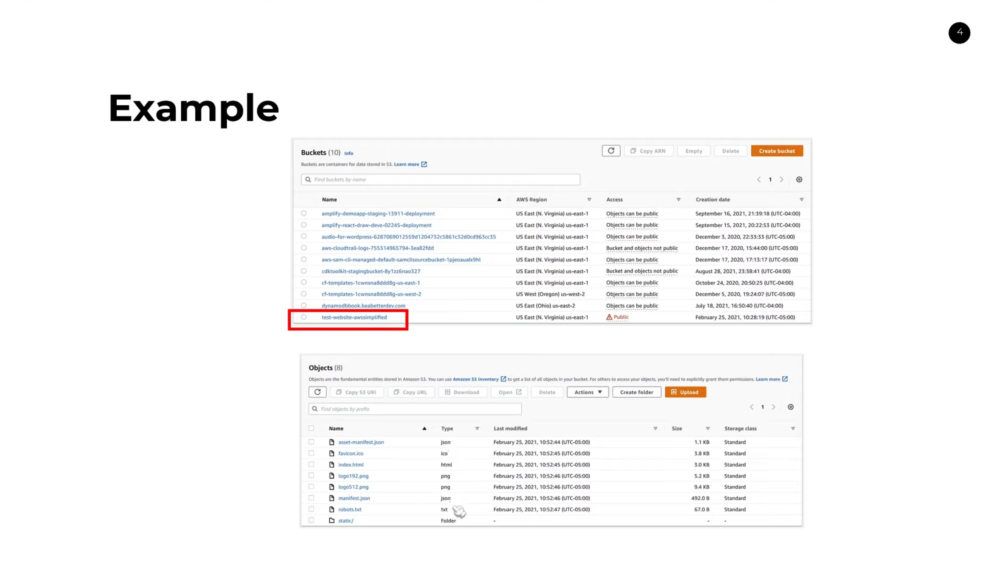

<br >

### Boto3: El SDK de Python para AWS

**¿Qué es boto3?**

- **SDK de AWS para Python:** Boto3 es el SDK oficial de Python para interactuar con los recursos de Amazon Web Services (AWS). Proporciona APIs completas para más de 160 servicios de AWS, incluyendo:
    - Almacenamiento (S3, Glacier, EBS)
    - Computación (EC2, Lambda, ECS)
    - Bases de datos (DynamoDB, RDS)
    - Redes (VPC, Route 53)
    - Aprendizaje automático (SageMaker, Rekognition)
    - Administración y gestión (IAM, CloudWatch)
    - ...¡y muchos más!

**Características principales:**

- **Abstracciones de alto nivel:** Simplifica las interacciones con servicios AWS complejos, promoviendo un código limpio y legible.
- **Gestión automática de detalles de bajo nivel:** Se encarga de las credenciales de AWS, la firma de solicitudes y la gestión de errores, ahorrándote tiempo y esfuerzo.
- **APIs potentes:** Ofrece control granular sobre diversas características de los servicios AWS, permitiendo diversos casos de uso.
- **Waiters y paginadores:** Mecanismos integrados para esperar eficientemente a que los recursos estén en el estado deseado y recuperar resultados paginados, respectivamente.
- **Context managers:** Agiliza la gestión de errores y la limpieza de recursos con el cierre automático de conexiones y la liberación de recursos.

**Casos de uso comunes:**

- **Administración del almacenamiento S3:** Carga, descarga, listado y manipulación de objetos en buckets de Amazon S3.
- **Creación y gestión de instancias EC2:** Lanzamiento, parada, terminación y configuración de instancias EC2.
- **Trabajo con tablas DynamoDB:** Creación, consulta, actualización y eliminación de elementos en tablas DynamoDB.
- **Automatización de implementaciones en AWS:** Gestión programática de la infraestructura y las configuraciones de los recursos.
- **Integración de los servicios AWS en las aplicaciones:** Aprovechamiento de las capacidades de AWS en sus proyectos basados en Python.

**Empezando:**

1. **Instalación:**
   ```bash
   pip install boto3
   ```

2. **Importar la biblioteca:**
   ```python
   import boto3
   ```

3. **Configurar las credenciales de AWS:**
   El enfoque más común es establecer variables de entorno:
   ```bash
   export AWS_ACCESS_KEY_ID="your_access_key_id"
   export AWS_SECRET_ACCESS_KEY="your_secret_access_key"
   ```
   Alternativamente, use un archivo de credenciales o roles IAM de instancia.

4. **Crear clientes u objetos de recursos:**
   ```python
   s3_client = boto3.client('s3')  # Cliente para interactuar con el servicio S3
   ec2_resource = boto3.resource('ec2')  # Recurso para crear y administrar instancias EC2
   ```

5. **Comenzar a utilizar los métodos de la API:**
   ```python
   # Subir un archivo a S3
   s3_client.upload_file(Filename="path/to/your/file.txt", 
                            Bucket="your-bucket-name", 
                            Key="my_file.txt")

   # Crear una instancia EC2
   instance = ec2_resource.create_instances(
       ImageId="ami-0123456789abcdef0",
       MinCount=1,
       MaxCount=1,
       InstanceType="t2.micro"
   )

   # Imprimir detalles de la instancia
   print(instance.id, instance.state)
   ```

* **Documentación de AWS SDK for Python :** https://boto3.amazonaws.com/v1/documentation/api/latest/index.html

### AWS Secrets Manager:

**¿Qué es?**

AWS Secrets Manager es un servicio que le ayuda a almacenar, administrar y rotar de forma segura las credenciales de bases de datos, las claves de API y otros datos confidenciales. Le permite:

* **Almacenar secretos de forma segura:** Cifra sus secretos en reposo y en tránsito, y los protege con controles de acceso granulares.
* **Administrar el acceso a los secretos:** Puede controlar quién puede acceder a sus secretos y para qué pueden usarlos.
* **Rotar secretos automáticamente:** Puede configurar Secrets Manager para que rote automáticamente sus secretos según un programa establecido.
* **Auditar el acceso a los secretos:** Puede ver quién ha accedido a sus secretos y cuándo lo ha hecho.

**Beneficios:**

* **Mejora la seguridad:** Reduce el riesgo de que se expongan sus datos confidenciales.
* **Simplifica la administración de secretos:** Elimina la necesidad de almacenar secretos en código o en archivos de configuración.
* **Mejora el cumplimiento:** Le ayuda a cumplir con los requisitos de cumplimiento que exigen la rotación regular de secretos.

**Casos de uso:**

* **Almacenar credenciales de bases de datos:** Secrets Manager es una forma segura de almacenar las credenciales de sus bases de datos, como las claves de usuario y las contraseñas.
* **Almacenar claves de API:** Puede almacenar de forma segura las claves de API para sus servicios en la nube, como AWS Lambda y Amazon S3.
* **Almacenar otros datos confidenciales:** Puede almacenar cualquier tipo de dato confidencial en Secrets Manager, como tokens de OAuth y claves SSH.

**Recursos adicionales:**

* **Documentación de AWS Secrets Manager:** [https://docs.aws.amazon.com/secretsmanager/latest/userguide/](https://docs.aws.amazon.com/secretsmanager/latest/userguide/)


## AWS S3:

**¿Qué es?**

Amazon Simple Storage Service (Amazon S3) es un servicio de almacenamiento de objetos que ofrece escalabilidad, disponibilidad de datos, seguridad y rendimiento líderes en el sector. Puede utilizarlo para almacenar cualquier tipo de datos, como:

* Archivos web y estáticos
* Imágenes y vídeos
* Registros y datos de aplicaciones
* Respaldos de datos
* Entornos de desarrollo y prueba

**Beneficios:**

* **Escalabilidad:** Puede almacenar cualquier cantidad de datos en Amazon S3. El servicio escala automáticamente para satisfacer sus necesidades de almacenamiento.
* **Disponibilidad de datos:** Amazon S3 ofrece una alta disponibilidad de datos. Sus datos se replican en varios centros de datos de todo el mundo.
* **Seguridad:** Amazon S3 ofrece una amplia gama de funciones de seguridad para proteger sus datos. Puede controlar quién puede acceder a sus datos y cómo se utilizan.
* **Rendimiento:** Amazon S3 ofrece un alto rendimiento para el almacenamiento y la recuperación de datos.

**Casos de uso:**

* **Almacenamiento web y estático:** Amazon S3 es una opción popular para almacenar archivos web y estáticos. Es una forma escalable y segura de servir contenido web a sus usuarios.
* **Almacenamiento de imágenes y vídeos:** Amazon S3 es una excelente opción para almacenar imágenes y vídeos. Puede utilizar el servicio para almacenar sus fotos personales, vídeos de vacaciones o imágenes de productos para su sitio web.
* **Respaldos de datos:** Amazon S3 puede utilizarse para realizar copias de seguridad de sus datos. Es una forma segura y fiable de proteger sus datos en caso de desastre.
* **Entornos de desarrollo y prueba:** Amazon S3 puede utilizarse para crear entornos de desarrollo y prueba. Puede utilizar el servicio para almacenar el código de su aplicación, los datos de prueba y otros archivos necesarios para sus proyectos de desarrollo.

**Recursos adicionales:**

* **Documentación de Amazon S3:** https://docs.aws.amazon.com/es_es/AmazonS3/latest/userguide/Welcome.html

## Componentes de Amazon S3

**Amazon S3** se compone de varios elementos clave que trabajan en conjunto para proporcionar un servicio de almacenamiento en la nube escalable y seguro. A continuación, se presenta una descripción general de los componentes principales:

**1. Buckets:** Son contenedores virtuales que almacenan sus datos en la nube. Actúan como unidades fundamentales de almacenamiento dentro de S3.

**2. Objetos:** Son las unidades individuales de datos que se almacenan dentro de un bucket. Cada objeto tiene un identificador único, metadatos (información sobre el objeto) y puede tener un tamaño de hasta 5 TB.

**3. Puntos de acceso:** Son interfaces de red virtuales que le permiten acceder a sus buckets S3 de forma segura y confiable. Puede crear puntos de acceso públicos o privados para controlar quién puede acceder a sus datos.

**4. Versiones de objetos:** Le permiten realizar un seguimiento de las diferentes versiones de un objeto a lo largo del tiempo. Esto puede ser útil para recuperar versiones anteriores de un archivo si se ha modificado accidentalmente o si necesita acceder a una versión específica para fines de cumplimiento.

**5. Lifecycle Management:** Le permite automatizar la administración de sus objetos S3. Puede configurar reglas para eliminar automáticamente objetos antiguos, moverlos a diferentes clases de almacenamiento o exportarlos a otros servicios de AWS.

**6. Replication:** Le permite crear copias redundantes de sus datos en diferentes regiones de AWS. Esto puede mejorar la disponibilidad y la durabilidad de sus datos en caso de un fallo regional.

**7. Encryption:** Le permite proteger sus datos en reposo y en tránsito mediante el uso de algoritmos de cifrado estándar de la industria.

**8. Server-Side Access Logging:** Le permite registrar todas las solicitudes realizadas a sus buckets S3. Estos registros pueden ser útiles para auditar el acceso a sus datos y para solucionar problemas.

**9. CloudWatch Monitoring:** Le permite monitorizar el rendimiento y la actividad de sus buckets S3. Puede utilizar CloudWatch para recibir alertas cuando se produzcan eventos específicos, como un aumento en el número de errores de solicitud.

**10. AWS Identity and Access Management (IAM):** Le permite controlar quién puede acceder a sus buckets S3 y qué acciones pueden realizar. Puede crear usuarios y grupos con diferentes permisos para controlar el acceso granular a sus datos.

**Además de estos componentes principales, S3 también ofrece una amplia gama de características adicionales, como:**

* **S3 Transfer Acceleration:** Acelera las transferencias de datos hacia y desde S3.
* **Amazon S3 Glacier:** Ofrece una opción de almacenamiento de bajo costo para datos a largo plazo.
* **Amazon S3 Object Lambda:** Le permite ejecutar código personalizado en respuesta a eventos S3.


<br >

<br >

<br >

<br>

**Clases de almacenamiento de Amazon S3:**

Las clases de almacenamiento de Amazon S3 son opciones de almacenamiento diseñadas para diferentes necesidades y casos de uso. Ofrecen diferentes niveles de rendimiento, disponibilidad y costo. Puede elegir la clase de almacenamiento que mejor se adapte a sus necesidades en función de la frecuencia con la que accede a sus datos y cuánto está dispuesto a pagar por el almacenamiento.

Estas son las clases de almacenamiento de Amazon S3 disponibles:

* **S3 Standard:** esta es la clase de almacenamiento predeterminada para Amazon S3. Es una buena opción para datos a los que se accede con frecuencia, como sitios web, aplicaciones y repositorios de código.

* **S3-IA:** esta clase de almacenamiento es una buena opción para datos a los que se accede con menos frecuencia , como copias de seguridad y archivos de datos. Es más barato que S3 Standard, pero tiene un mayor tiempo de recuperación.

* **S3 One Zone-IA:** esta clase de almacenamiento es similar a S3-IA, pero está diseñado para almacenar datos en una sola zona de disponibilidad. Esto lo hace más barato que S3-IA, pero también lo hace menos disponible.

* **S3 Glacier:** esta clase de almacenamiento es una buena opción para datos de archivo a largo plazo. Es el más barato clase de almacenamiento, pero tiene el mayor tiempo de recuperación.

* **S3 Deep Archive:** esta clase de almacenamiento es la opción más económica para el almacenamiento de datos a largo plazo. Está diseñado para datos que necesitan ser retenidos durante períodos prolongados de tiempo y a los que rara vez se accede.


Puede elegir la clase de almacenamiento adecuada para sus necesidades utilizando la siguiente tabla:

| **Clase de almacenamiento** | **Acceso** | **Costo** | **Disponibilidad** |
|---|---|---|---|
| S3 Standard | Frecuente | Alto | Alto |
| S3-IA | Poco frecuente | Medio | Medio |
| S3 One Zone-IA | Poco frecuente | Bajo | Bajo |
| Glaciar S3 | Raro | Bajo | Bajo |
| S3 Deep Archive | Rara vez | Más bajo | Más bajo |

Además de las clases de almacenamiento, también puede usar Amazon S3 Lifecycle para automatizar la transición de sus datos a diferentes clases de almacenamiento en función de su edad. Esto puede ayudarlo a ahorrar dinero al mover datos a clases de almacenamiento más baratas a medida que envejecen.

Para obtener más información sobre las clases de almacenamiento de Amazon S3, consulte la siguiente documentación:

* Tipos de almacenamiento en la nube: [https://aws.amazon.com/es/s3/storage-classes/](https://aws.amazon.com/es/s3/storage-classes/)
* Uso de las clases de almacenamiento de Amazon S3: [https://docs.aws.amazon.com/es_es/AmazonS3/latest/userguide/storage-class-intro.html](https://docs.aws.amazon.com/es_es/AmazonS3/latest/userguide/storage-class-intro.html)

## Versionado S3: Una red de seguridad para sus datos

**¿Qué es?**

El versionado de Amazon S3 es una función que le permite realizar un seguimiento de todas las versiones de un objeto a medida que cambia. Esto significa que puede recuperar versiones anteriores de un objeto, incluso si lo ha sobrescrito o eliminado accidentalmente.

**¿Cómo funciona?**

Cuando habilita el versionado para un bucket de S3, cada vez que carga un nuevo objeto o modifica uno existente, S3 crea una nueva versión del objeto. Cada versión tiene un identificador único que incluye la fecha y hora en que se creó.

**¿Cuáles son los beneficios?**

* **Protección contra errores humanos:** Si elimina accidentalmente un objeto o lo sobrescribe con una versión incorrecta, puede restaurarlo fácilmente a una versión anterior.
* **Seguimiento de cambios:** Puede ver el historial de cambios de un objeto para ver quién lo modificó y cuándo.
* **Cumplimiento normativo:** El versionado puede ayudarlo a cumplir con los requisitos normativos que exigen que conserve registros de sus datos durante un período de tiempo específico.

**¿Cuáles son las limitaciones?**

* **Costo:** Se le cobra por almacenar cada versión de un objeto.
* **Complejidad:** El versionado puede agregar complejidad a la administración de sus buckets de S3.

**¿Cómo habilitarlo?**

Puede habilitar el versionado para un bucket de S3 en la consola de administración de AWS, la API de AWS o la CLI de AWS.

**¿Cómo usarlo?**

Puede recuperar versiones anteriores de un objeto utilizando la consola de administración de AWS, la API de AWS o la CLI de AWS.

**Para obtener más información:**

* Documentación de Amazon S3 sobre el versionado: [https://docs.aws.amazon.com/es_es/AmazonS3/latest/userguide/Versioning.html](https://docs.aws.amazon.com/es_es/AmazonS3/latest/userguide/Versioning.html)

**Resumen:**

El versionado de S3 es una herramienta poderosa que puede ayudarlo a proteger sus datos contra errores humanos, realizar un seguimiento de los cambios y cumplir con los requisitos normativos. Sin embargo, es importante tener en cuenta las limitaciones de costo y complejidad antes de habilitarlo.


## AWS RDS:

**¿Qué es?**

Amazon Relational Database Service (RDS) es un servicio de base de datos relacional gestionado que facilita la configuración, operación y escalado de una base de datos en la nube. Le permite ejecutar bases de datos populares como MySQL, PostgreSQL, Aurora (MySQL y PostgreSQL compatible), MariaDB, Oracle Database, SQL Server y Amazon Redshift sin tener que gestionar la infraestructura subyacente.

**Beneficios:**

* **Facilidad de uso:** RDS simplifica la configuración y la gestión de bases de datos en la nube. No necesita gestionar la instalación, el parcheado, la copia de seguridad ni la escalabilidad de la infraestructura subyacente.
* **Alto rendimiento y disponibilidad:** RDS ofrece alto rendimiento y disponibilidad para sus bases de datos. Puede elegir entre varias opciones de almacenamiento y configuraciones de hardware para satisfacer sus necesidades de rendimiento.
* **Seguridad:** RDS ofrece una amplia gama de funciones de seguridad para proteger sus datos. Puede controlar quién puede acceder a sus bases de datos y cómo se utilizan.
* **Compatibilidad:** RDS es compatible con muchos motores de bases de datos populares, lo que le facilita la migración de sus bases de datos locales a la nube.
* **Costo-efectivo:** RDS tiene un precio basado en el uso, lo que significa que sólo paga por los recursos que utiliza.

**Casos de uso:**

* **Aplicaciones web y móviles:** RDS puede utilizarse para almacenar datos para aplicaciones web y móviles.
* **Comercio electrónico:** RDS puede utilizarse para almacenar datos de productos, pedidos y clientes.
* **Juegos:** RDS puede utilizarse para almacenar datos de jugadores, partidas y logros.
* **Analítica:** RDS puede utilizarse para almacenar datos para análisis empresariales.
* **Cualquier aplicación que requiera una base de datos relacional:** Puede utilizar RDS para almacenar datos para cualquier aplicación que requiera una base de datos relacional.

**Recursos adicionales:**

* **Documentación de RDS:** [https://docs.aws.amazon.com/AmazonRDS/latest/UserGuide/Welcome.html](https://docs.aws.amazon.com/AmazonRDS/latest/UserGuide/Welcome.html)

Un cluster en Amazon RDS, también conocido como **clúster de base de datos**, es un grupo de instancias de base de datos que trabajan juntas para proporcionar alta disponibilidad, escalabilidad y rendimiento. 

Existen dos tipos principales de clusters en RDS:

* **Clusters de base de datos de Amazon Aurora:** Son clusters altamente disponibles y escalables que ofrecen una opción compatible con MySQL y PostgreSQL. Se componen de una instancia de base de datos de escritor y una o más instancias de base de datos de lectura "[https://docs.aws.amazon.com/AmazonRDS/latest/AuroraUserGuide/CHAP_AuroraOverview.html](https://docs.aws.amazon.com/AmazonRDS/latest/AuroraUserGuide/CHAP_AuroraOverview.html)".
* **Clusters de base de datos Multi-AZ:** Son grupos de instancias de base de datos que se extienden por varias Zonas de Disponibilidad (AZ) dentro de una región de AWS. Esto proporciona alta disponibilidad y resistencia a fallos de hardware o software en una sola AZ "[https://docs.aws.amazon.com/AmazonRDS/latest/UserGuide/Concepts.RDS_Fea_Regions_DB-eng.Feature.MultiAZDBClusters.html](https://docs.aws.amazon.com/AmazonRDS/latest/UserGuide/Concepts.RDS_Fea_Regions_DB-eng.Feature.MultiAZDBClusters.html)".

Los clusters de RDS ofrecen varias ventajas sobre las instancias de base de datos individuales, que incluyen:

* **Alta disponibilidad:** Si una instancia de base de datos en el cluster falla, las restantes pueden hacerse cargo automáticamente para garantizar que la aplicación tenga acceso a los datos.
* **Escalabilidad:** Puede agregar o eliminar fácilmente instancias del cluster para satisfacer las necesidades cambiantes de su aplicación.
* **Rendimiento mejorado:** Los clusters pueden distribuir la carga de trabajo entre varias instancias, lo que puede mejorar el rendimiento general de la base de datos.

En resumen, un cluster en AWS RDS es una opción valiosa para aplicaciones que requieren alta disponibilidad, escalabilidad y rendimiento.

## AWS Redshift:

**¿Qué es?**

Amazon Redshift es un data warehouse rápido, escalable y totalmente gestionado, diseñado para analizar petabytes de datos estructurados y semiestructurados. Construido sobre tecnología MPP (procesamiento masivamente paralelo), proporciona un alto rendimiento y una excelente relación coste-rendimiento para consultas complejas en grandes conjuntos de datos.

**Ventajas:**

* **Rendimiento y escalabilidad:** Redshift ofrece un rendimiento líder en el sector para consultas analíticas en grandes datasets. Puede escalar automáticamente para satisfacer las necesidades de su carga de trabajo.
* **Fácil de usar:** Redshift es un servicio totalmente gestionado, lo que significa que AWS se encarga de la configuración, la operación y el mantenimiento de la infraestructura subyacente. Solo tiene que cargar sus datos y empezar a consultar.
* **Bajo coste:** Redshift tiene un precio basado en el uso, lo que significa que solo paga por los recursos que utiliza.
* **Compatibilidad:** Redshift utiliza SQL estándar, por lo que puede utilizar las mismas herramientas y habilidades que ya tiene para analizar sus datos.
* **Integración con otros servicios de AWS:** Redshift se integra perfectamente con otros servicios de AWS, como Amazon S3, Amazon EMR y Amazon QuickSight, lo que facilita la creación de pipelines de datos e informes analíticos.

**Casos de uso:**

* **Análisis de marketing:** Analice grandes cantidades de datos de clientes para comprender mejor su comportamiento y tomar decisiones empresariales más informadas.
* **Análisis financiero:** Realice análisis financieros complejos para evaluar el rendimiento de la empresa y tomar decisiones de inversión.
* **Análisis operativo:** Analice datos operativos para identificar áreas de mejora y optimizar sus procesos empresariales.
* **Análisis de fraude:** Detecta y previene el fraude analizando patrones de actividad maliciosa.
* **Cualquier aplicación que requiera análisis de big data:** Puede utilizar Redshift para analizar grandes cantidades de datos para una amplia variedad de casos de uso.

**Recursos adicionales:**

* Documentación de Redshift: [https://docs.aws.amazon.com/redshift/latest/mgmt/welcome.html](https://docs.aws.amazon.com/redshift/latest/mgmt/welcome.html)

## AWS ECS:

**¿Qué es Amazon ECS?**

Amazon Elastic Container Service (Amazon ECS) es un servicio de orquestación de contenedores totalmente gestionado que ayuda a:

* **Desplegar** aplicaciones en contenedores
* **Escalar** las aplicaciones automáticamente para satisfacer la demanda
* **Administrar** el ciclo de vida de las aplicaciones en contenedores

**Beneficios:**

* **Reduce la complejidad:** Gestiona la infraestructura subyacente para que pueda centrarse en desarrollar su aplicación.
* **Aumenta la agilidad:** Implemente y escale las aplicaciones rápidamente con solo unos pocos clics.
* **Mejora la fiabilidad:** Las aplicaciones en contenedores se recuperan automáticamente de los fallos.
* **Reduce los costes:** Pague solo por los recursos que utilice.

**Casos de uso:**

* **Ejecutar microservicios:** Divida las aplicaciones en componentes pequeños e independientes.
* **Ejecutar aplicaciones sin estado:** Ejecute aplicaciones que no almacenen datos entre llamadas.
* **Ejecutar tareas por lotes:** Ejecute trabajos por lotes en paralelo para un procesamiento más rápido.
* **Modernizar aplicaciones monolíticas:** Migre aplicaciones monolíticas a contenedores.

**Componentes clave:**

* **Contenedores:** Unidades estándar de software empaquetadas que incluyen el código de la aplicación y sus dependencias.
* **Grupos de tareas:** Definen un conjunto de tareas que se ejecutan en un clúster.
* **Servicios:** Representaciones escalables y duraderas de grupos de tareas ejecutados en un clúster.
* **Clústeres:** Infraestructura informática subyacente para ejecutar grupos de tareas y servicios.

**Opciones de implementación:**

* **AWS Fargate:** Opción sin servidor donde AWS gestiona la infraestructura subyacente.
* **Modo EC2:** Utilice instancias EC2 para ejecutar sus contenedores.

**Recursos adicionales:**

* Documentación de Amazon ECS: [https://docs.aws.amazon.com/AmazonECS/latest/developerguide/Welcome.html](https://docs.aws.amazon.com/AmazonECS/latest/developerguide/Welcome.html)

## AWS AirFlow:

**¿Qué es Amazon Managed Workflows for Apache Airflow (MWAA)?**

AWS MWAA es un servicio gestionado de Apache Airflow que le permite ejecutar sus flujos de trabajo de Airflow existentes en un entorno seguro y escalable en la nube de AWS. 

**Beneficios:**

* **Facilidad de uso:** No necesita gestionar la infraestructura subyacente, las actualizaciones de Apache Airflow ni las integraciones con los servicios de AWS.
* **Escalabilidad automática:** Las instancias se escalan automáticamente para satisfacer las demandas de sus flujos de trabajo.
* **Alta disponibilidad:** El servicio está diseñado para ser altamente disponible y resistente a fallos.
* **Seguridad:** Su entorno de Airflow está aislado y protegido con las prácticas de seguridad de AWS.
* **Integración con servicios de AWS:** Se integra fácilmente con otros servicios de AWS, como S3, RDS, Lambda y más.

**Casos de uso:**

* **Orquestar ETL/ELT pipelines:** Mueva datos entre diferentes fuentes y destinos de forma automatizada.
* **Automatizar tareas de ML:** Ejecute trabajos de entrenamiento de modelos, evaluación y análisis de resultados.
* **Ejecutar tareas programadas:** Cree flujos de trabajo para tareas como enviar notificaciones, generar informes o ejecutar scripts.
* **Gestionar complejos flujos de trabajo:** Cree dependencias entre tareas y gestione la ejecución condicional.

**¿Cómo funciona MWAA?**

* Usted proporciona sus DAGs (Directed Acyclic Graphs) de Airflow y configuraciones.
* MWAA establece y gestiona automáticamente el entorno de Airflow en su cuenta de AWS.
* Puede acceder a la interfaz web de Airflow y gestionar sus flujos de trabajo como lo haría con una implementación local.

**Recursos adicionales:**

* **Documentación de MWAA:** https://docs.aws.amazon.com/mwaa/latest/userguide/what-is-mwaa.html

##  LocalStack

**LocalStack** es una herramienta de código abierto que te permite ejecutar servicios de AWS en tu propio ordenador. Es una excelente opción para:

* **Desarrollar aplicaciones localmente:** Puedes probar tu código sin necesidad de conectarte a la nube de AWS, lo que te permite trabajar sin conexión a internet y ahorrar costes.
* **Testear integraciones con AWS:** Puedes configurar un entorno de prueba con los servicios de AWS que necesitas para tus pruebas, sin afectar a tu entorno de producción.
* **Demostrar y aprender sobre AWS:** Puedes experimentar con diferentes servicios de AWS sin necesidad de crear una cuenta en la nube.

**LocalStack ofrece una amplia gama de servicios de AWS**, incluyendo:

* EC2 (instancias de computación)
* S3 (almacenamiento de objetos)
* Lambda (funciones sin servidor)
* RDS (bases de datos relacionales)
* SNS (servicio de notificaciones)
* SQS (colas de mensajes)
* DynamoDB (base de datos NoSQL)
* API Gateway (pasarela de APIs)

**Es fácil de usar:**

1. Instala LocalStack en tu ordenador.
2. Inicia LocalStack con el comando `localstack start`.
3. Configura tu aplicación para usar los endpoints locales de LocalStack.
4. ¡Comienza a usar los servicios de AWS!

**LocalStack es una herramienta poderosa y versátil** que puede ayudarte a desarrollar, probar y aprender sobre AWS de forma más eficiente.

**Recursos adicionales:**

* Sitio web de LocalStack: [https://localstack.cloud/](https://localstack.cloud/)
* Documentación de LocalStack: [https://localstack.cloud/docs/](https://localstack.cloud/docs/)

## AWS Lambda: 

**¿Qué es AWS Lambda?**

AWS Lambda es un servicio de computación sin servidor ("serverless") de Amazon Web Services (AWS) que te permite ejecutar código sin necesidad de aprovisionar o gestionar servidores. Se activa mediante eventos y solo pagas por los recursos que utilizas. Es una forma flexible y escalable de ejecutar código para una amplia variedad de aplicaciones.

**Características principales:**

* **Sin servidores:** No necesitas aprovisionar ni gestionar servidores. AWS Lambda se encarga de todo lo relacionado con la infraestructura, como el aprovisionamiento de capacidad, el escalado automático y el registro.
* **Basado en eventos:** Lambda se activa mediante eventos. Puedes configurar Lambda para que se ejecute en respuesta a eventos de otros servicios de AWS, como S3, DynamoDB o CloudWatch, o desde aplicaciones externas.
* **Altamente escalable:** Lambda puede escalarse automáticamente para manejar cualquier carga de trabajo. Solo pagas por los recursos que utilizas.
* **Económico:** Solo pagas por el tiempo de ejecución que utiliza tu código. No hay cargos por aprovisionamiento ni por inactividad.
* **Fácil de usar:** Puedes desarrollar y desplegar funciones Lambda con rapidez y facilidad. Lambda admite una amplia variedad de lenguajes de programación y marcos de trabajo.

**Aplicaciones destacadas:**

* **Procesamiento de datos:** Lambda puede utilizarse para procesar datos de diversas fuentes, como archivos, flujos de datos y bases de datos.
* **Aplicaciones web y móviles:** Lambda puede utilizarse para crear backends para aplicaciones web y móviles.
* **IoT:** Lambda puede utilizarse para conectar dispositivos IoT y procesar sus datos.
* **Análisis:** Lambda puede utilizarse para analizar datos y generar informes.
* **Herramientas de administración:** Lambda puede utilizarse para crear herramientas de administración para tu infraestructura AWS.

**En resumen, AWS Lambda es una herramienta potente y versátil que te permite ejecutar código de forma flexible y escalable sin necesidad de gestionar servidores. Es una excelente opción para una amplia variedad de aplicaciones.**

**Para obtener más información sobre AWS Lambda, puedes visitar los siguientes recursos:**

* **Sitio web de AWS Lambda:** [https://aws.amazon.com/lambda/](https://aws.amazon.com/lambda/)
* **Documentación de AWS Lambda:** [https://docs.aws.amazon.com/lambda/](https://docs.aws.amazon.com/lambda/)
* **Tutoriales de AWS Lambda:** [https://aws.amazon.com/lambda/getting-started/](https://aws.amazon.com/lambda/getting-started/)

## Ejemplos de eventos que pueden desencadenar una función Lambda:

**Eventos de Amazon S3:**

* **Objeto creado:** Se invoca una función Lambda cada vez que se carga un nuevo objeto en un bucket de S3. Puedes usar esto para procesar los archivos que se cargan, como generar miniaturas de imágenes o extraer texto de documentos PDF.
* **Objeto eliminado:** Se invoca una función Lambda cada vez que se elimina un objeto de un bucket de S3. Puedes usar esto para liberar espacio de almacenamiento o registrar la eliminación de archivos.
* **Objeto modificado:** Se invoca una función Lambda cada vez que se modifica un objeto en un bucket de S3. Puedes usar esto para actualizar metadatos o realizar otras acciones en función de los cambios realizados en el archivo.

**Eventos de Amazon DynamoDB:**

* **Inserción:** Se invoca una función Lambda cada vez que se inserta un nuevo elemento en una tabla de DynamoDB. Puedes usar esto para enviar notificaciones, actualizar otros sistemas o realizar otras acciones en función de los datos insertados.
* **Actualización:** Se invoca una función Lambda cada vez que se actualiza un elemento existente en una tabla de DynamoDB. Puedes usar esto para mantener la coherencia de los datos en otros sistemas o realizar otras acciones en función de los cambios realizados en el elemento.
* **Eliminación:** Se invoca una función Lambda cada vez que se elimina un elemento de una tabla de DynamoDB. Puedes usar esto para liberar espacio de almacenamiento o registrar la eliminación de elementos.

**Eventos de AWS CloudWatch:**

* **Alarma:** Se invoca una función Lambda cada vez que se activa una alarma de CloudWatch. Puedes usar esto para enviar notificaciones, tomar medidas correctivas o realizar otras acciones en respuesta a la alarma.
* **Métrica:** Se invoca una función Lambda cada vez que se publica una nueva métrica en CloudWatch. Puedes usar esto para analizar los datos de las métricas o realizar otras acciones en función de los valores de las métricas.
* **Registro:** Se invoca una función Lambda cada vez que se registran nuevos registros en CloudWatch Logs. Puedes usar esto para analizar los registros, buscar patrones o realizar otras acciones en función de los datos de los registros.

**Otros eventos:**

* **Solicitudes HTTP:** Puedes usar Amazon API Gateway para invocar una función Lambda en respuesta a solicitudes HTTP. Esto es útil para crear backends web y móviles sin necesidad de aprovisionar ni gestionar servidores web.
* **Eventos personalizados:** Puedes crear tus propios eventos personalizados y usarlos para invocar funciones Lambda. Esto te da flexibilidad para crear aplicaciones que se adapten a tus necesidades específicas.

## Eventos poco comunes pero interesantes para AWS Lambda:

Si bien los ejemplos que te mencioné anteriormente son algunos de los eventos más comunes que se utilizan con AWS Lambda, existen muchos otros eventos menos comunes que pueden ser interesantes para investigar y explorar. Estos eventos pueden ser útiles para crear aplicaciones únicas e innovadoras. A continuación, te presento algunos ejemplos:

**1. Eventos de Amazon Kinesis:**

* **Flujo de datos:** Se invoca una función Lambda cada vez que se registra un nuevo lote de datos en una transmisión de Kinesis. Puedes usar esto para procesar datos en tiempo real, como analizar flujos de datos de sensores o realizar análisis de fraude.
* **Registro de registros:** Se invoca una función Lambda cada vez que se registran nuevos registros en Amazon Kinesis Firehose. Puedes usar esto para analizar registros de alta velocidad provenientes de aplicaciones, servidores y dispositivos.

**2. Eventos de Amazon SNS:**

* **Notificación de mensaje:** Se invoca una función Lambda cada vez que se recibe un nuevo mensaje en un tema de SNS. Puedes usar esto para enviar notificaciones por correo electrónico, SMS o notificaciones push a aplicaciones móviles.
* **Suscripción a un tema:** Se invoca una función Lambda cada vez que una nueva suscripción se agrega a un tema de SNS. Puedes usar esto para dar la bienvenida a nuevos suscriptores o enviarles información inicial.
* **Cancelación de suscripción a un tema:** Se invoca una función Lambda cada vez que se cancela una suscripción a un tema de SNS. Puedes usar esto para eliminar a los suscriptores inactivos o enviarles un correo electrónico de despedida.

**3. Eventos de AWS IoT Core:**

* **Dispositivo conectado:** Se invoca una función Lambda cada vez que un dispositivo se conecta a AWS IoT Core. Puedes usar esto para inicializar el dispositivo, registrarlo en un grupo o suscribirlo a temas de SNS.
* **Dispositivo desconectado:** Se invoca una función Lambda cada vez que un dispositivo se desconecta de AWS IoT Core. Puedes usar esto para detectar fallas del dispositivo, enviar alertas o tomar otras medidas correctivas.
* **Mensaje publicado:** Se invoca una función Lambda cada vez que un dispositivo publica un mensaje en un tema de AWS IoT Core. Puedes usar esto para procesar los datos del dispositivo, tomar medidas en función de los datos o enviar notificaciones.

**4. Eventos de AWS API Gateway:**

* **Solicitud HTTP:** Se invoca una función Lambda cada vez que se recibe una solicitud HTTP en una API Gateway. Puedes usar esto para crear backends web y móviles, implementar APIs RESTful o crear aplicaciones web dinámicas.
* **Autenticación de usuario:** Se invoca una función Lambda cada vez que un usuario se autentica correctamente en una API Gateway. Puedes usar esto para personalizar la experiencia del usuario, registrar la actividad del usuario o aplicar controles de acceso basados en roles.

**5. Eventos personalizados:**

* **Evento personalizado de aplicación:** Puedes crear tus propios eventos personalizados y usarlos para invocar funciones Lambda. Esto te da la flexibilidad de crear aplicaciones que se adapten a tus necesidades específicas.
* **Evento programado:** Puedes usar AWS CloudWatch Events para programar la invocación de una función Lambda en un momento específico o con una periodicidad determinada. Esto es útil para ejecutar tareas recurrentes, como enviar informes diarios o procesar datos por lotes.

**Estos son solo algunos ejemplos de eventos poco comunes pero interesantes que puedes utilizar con AWS Lambda. Con un poco de creatividad, puedes encontrar muchas otras formas de usar Lambda para crear aplicaciones innovadoras y útiles.**

## Amazon API Gateway

**¿Qué es?**

Amazon API Gateway es un servicio de AWS que te permite crear, publicar, mantener, monitorizar y proteger APIs REST, HTTP y WebSocket a cualquier escala. 

**¿Cómo funciona?**

API Gateway actúa como una puerta de entrada única para tus APIs, enrutando las solicitudes de los clientes a los backend adecuados. Puedes conectarlo a diversos servicios backend, como:

* Funciones de AWS Lambda
* Amazon Elastic Compute Cloud (EC2)
* Aplicaciones web
* Otros servicios de AWS

**Características principales:**

* **Soporte para múltiples tipos de API:** RESTful, HTTP y WebSocket
* **Mecanismos de autenticación y autorización potentes:** Políticas de AWS IAM, funciones Lambda de autorizador y grupos de usuarios de Amazon Cognito
* **Monitoreo y registro detallados:** Supervisa el rendimiento de la API y registra las solicitudes y respuestas
* **Seguridad mejorada:** Protección contra ataques DDoS, inyección de SQL y cross-site scripting
* **Escalabilidad flexible:** Maneja desde unas pocas solicitudes por minuto hasta millones de solicitudes por segundo
* **Precios basados en el uso:** Paga solo por las solicitudes que realizas

**Beneficios de usar API Gateway:**

* **Simplifica la creación y gestión de APIs:** Proporciona una interfaz visual para crear, publicar y mantener APIs
* **Mejora la seguridad de las APIs:** Protege tus APIs contra accesos no autorizados
* **Te ayuda a escalar tus APIs:** Maneja automáticamente el aumento del tráfico
* **Te ofrece una visión completa del rendimiento de tus APIs:** Monitoriza el rendimiento de las APIs y registra las solicitudes y respuestas

**Casos de uso:**

* **Exponer datos y funcionalidad a aplicaciones móviles y web**
* **Crear APIs para integraciones entre sistemas**
* **Desarrollar aplicaciones de IoT**
* **Crear APIs para juegos en línea**

**Recursos adicionales:**

* **Documentación de Amazon API Gateway:** [https://docs.aws.amazon.com/apigateway/](https://docs.aws.amazon.com/apigateway/)

**En resumen, Amazon API Gateway es una herramienta poderosa y versátil que te puede ayudar a crear, publicar, mantener, monitorizar y proteger APIs a cualquier escala.**


## API Gateway y API REST: Trabajando juntos en AWS

En AWS, API Gateway funciona como una "puerta de enlace" para tus API REST (RESTful). Veamos qué significa cada término y cómo colaboran:

**API REST (RESTful):**

- **Interfaz de programación de aplicaciones:** Es un conjunto de reglas que define cómo las aplicaciones se comunican entre sí. REST es un estilo arquitectónico popular para las API RESTful.
- **RESTful:** Cumple con los principios de REST, como la comunicación sin estado (el servidor no necesita recordar las interacciones previas con un cliente), el uso de verbos HTTP estándar (GET, POST, PUT, DELETE) y la representación de recursos en un formato como JSON o XML.

**API Gateway:**

- **Gestor de API:** Actúa como un intermediario entre los clientes que solicitan recursos y los servicios backend que proporcionan esos recursos.
- **Funciones:**
    - **Punto de entrada único:** Todas las solicitudes de API pasan a través de API Gateway, lo que simplifica la administración y el control de acceso.
    - **Enrutamiento:** API Gateway dirige las solicitudes a los servicios backend adecuados en función de la URL solicitada y el método HTTP utilizado.
    - **Funciones adicionales:** Puede realizar tareas como la autenticación, la autorización, la limitación de velocidad y el registro de solicitudes.

**Trabajando en conjunto:**

- Imagine que tiene una aplicación móvil que necesita acceder a datos de un servidor backend. La aplicación móvil envía una solicitud REST a API Gateway.
- API Gateway recibe la solicitud, la autentifica y la enruta al servicio backend apropiado.
- El servicio backend procesa la solicitud, recupera los datos y devuelve una respuesta.
- API Gateway devuelve la respuesta al cliente móvil.

**Beneficios:**

- **Simplicidad:** API Gateway facilita la creación, publicación, mantenimiento y protección de tus API REST a cualquier escala.
- **Flexibilidad:** Se integra con varios servicios backend de AWS, incluidos AWS Lambda, Amazon EC2 y aplicaciones web.
- **Escalabilidad:** Puede manejar grandes volúmenes de tráfico sin problemas.
- **Seguridad:** Ofrece funciones de seguridad integradas, como la autenticación y la autorización.

**En resumen:**

API Gateway y las API REST trabajan juntas para proporcionar una forma segura, escalable y flexible de crear y administrar servicios web en AWS. API Gateway actúa como una capa de abstracción, ocultando los detalles de la implementación del backend y simplificando la comunicación entre clientes y servicios.


## API Gateway WebSockets:

API Gateway en Amazon Web Services (AWS) te permite crear canales de comunicación bidireccionales y en tiempo real entre clientes web y servicios backend. Esto contrasta con las API REST tradicionales, que funcionan con un modelo de solicitud-respuesta.

**Características clave:**

- **Comunicación bidireccional:** Los clientes pueden enviar mensajes al servidor, y el servidor puede enviar datos de forma proactiva a los clientes conectados sin que estos tengan que hacer solicitudes explícitas. Esto permite actualizaciones de datos en tiempo real y experiencias interactivas.
- **Integración con backends:** API Gateway WebSockets se puede integrar con varios servicios backend, incluidas funciones AWS Lambda, puntos finales HTTP u otros servicios AWS. Esta flexibilidad te permite adaptar la API a los requisitos específicos de tu aplicación.
- **Funciones de administración de API:** API Gateway ofrece un conjunto de funciones para administrar tus API WebSocket durante todo su ciclo de vida, incluida la creación, autorización, limitación, monitoreo y control de versiones. Esto simplifica el desarrollo y mantenimiento de la API.

**Beneficios del uso de API Gateway WebSockets:**

- **Actualizaciones en tiempo real:** Permite que las aplicaciones muestren actualizaciones de datos en vivo (por ejemplo, precios de acciones, mensajes de chat, lecturas de sensores) sin necesidad de sondeo constante del lado del cliente.
- **Carga reducida del servidor:** Al enviar actualizaciones en lugar de depender del sondeo del cliente, puedes minimizar la carga del servidor y mejorar la capacidad de respuesta de la aplicación.
- **Experiencia de usuario mejorada:** Las interacciones en tiempo real crean una experiencia de usuario más atractiva y dinámica, especialmente para aplicaciones que requieren un flujo continuo de datos.

**Casos de uso comunes:**

- **Aplicaciones de chat en tiempo real:** Los WebSockets son ideales para crear aplicaciones de chat donde los usuarios necesitan ver los mensajes a medida que se envían, sin necesidad de refrescar la página.
- **Paneles de datos en vivo:** Actualiza los paneles con flujos de datos en tiempo real (por ejemplo, resultados deportivos, mercados financieros, datos de sensores IoT) para una visualización inmediata.
- **Edición colaborativa:** Facilita la colaboración en tiempo real en documentos, código u otro contenido, asegurando que todos vean los cambios simultáneamente.
- **Juegos multijugador:** Habilita la comunicación de baja latencia entre jugadores en juegos en línea, permitiendo interacciones y actualizaciones en tiempo real.

**En resumen:**

API Gateway WebSockets proporciona una herramienta poderosa para crear aplicaciones web interactivas en tiempo real. Al aprovechar la comunicación bidireccional, la integración con varios backends y las funciones de administración de API, puedes crear una experiencia de usuario dinámica y atractiva. Si estás desarrollando una aplicación que requiere actualizaciones de datos en tiempo real o interacciones de baja latencia, considera usar API Gateway WebSockets como base para tu arquitectura de comunicación.


